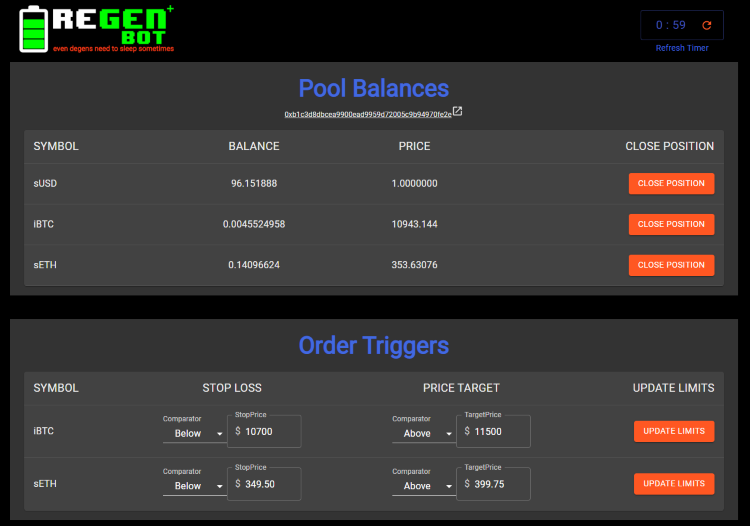

# REGEN BOT

#### Even degens need to sleep sometimes

Welcome to Regen Bot, the easy way to manage Stop Loss and Profit Target orders for your DHedge Pool.

This bot and documentation are intended to make it easy for someone with little or no coding experience to set up and manage positions. I have tried to keep the program simple and make the documentation thorough, so even if you've never used Command Prompt before you should be able to run this. You can run the program with fairly minimal setup on Windows, Mac or Linux. A Raspberry Pi is perfect for it.

Regen Bot is set to refresh every 2 minutes. It checks and displays your current positions. It also allows you to enter a Trigger Price for Stop Loss and Profit Target orders. When RegenBot refreshes it checks the current price against the Triggers, and submits an order to exit the position into sUSD if appropriate.



### **PREREQUISITES**

1. Install Node.js

   This is a straight-forward install. Download the appropriate installer from https://nodejs.org/en/download/ for your OS, then follow the instructions. There are also many videos and tutorials available.

2. Install a Code Editor/Text Editor

   This step is somewhat optional. You will need to be able to open and edit the '.env.example' file. I use VSCode, which you can download here: https://code.visualstudio.com/ Another popular option is Atom. Notepad++ is a more minimal version that will work for this.

3. Sign up for Infura API Key

   Infura is a service that allows you to communicate with the Ethereum blockchain without running your own node. Go to https://infura.io/ and sign up for a free account. Once you've signed up, on the left hand NavBar click 'Ethereum'. Then click 'Create New Project', give it a name and copy your 'Project Secret'. Save it in a safe place you will need it later. Click 'Save Changes' in Infura.

4. Sign up for an EthGasStation API Key

   Defi Pulse is the company that powers EthGasStation. Sign up here https://data.defipulse.com/ for a free API Key. Once you have signed up make sure the Selected Project at the top is EthGasStation and then copy the API Key. Save it in a safe place you will need it later.

5. You'll need your DHedge Pool Address. If you don't have one already, head to app.dhedge.org to get started!

### **Clone or Download the Git Repo**

If you are familiar with Git, create a directory and clone this Repo so that you can get updates as the project improves.

If you are not familiar with Git, and would like to quick start this program, scroll up and click the green "Code" button above and choose Download Zip. Extract the files into some directory. For example in Windows you can un-zip into C:\Users\YOUR_USERNAME. I will use the folder name `RegenBot` for the rest of this tutorial.

### **Install Dependencies**

After you have extracted the files, open a Command Prompt/Terminal. (For Windows type "cmd" into the search box on the taskbar). Navigate to the directory that you extracted the files into. For Windows, Command Prompt will open to the "Users\YOUR_USERNAME" directory. If you placed your folder here, simply type cd RegenBot.

> C:\Users\YOUR_USERNAME> cd RegenBot

Then once you are in that directory type `npm install`

> C:\Users\YOUR_USERNAME\RegenBot> npm install

Now the program is installed, but it needs a bit of initial configuration. Keep the Terminal/Command Prompt open

### **Modify .env.example**

This file holds the variables particular to your specific setup. This includes your Public Wallet Address, your API Key for Infura and EthGasStation, and an Encrypted version of your Private Key.

1. Open this project in your code/text editor. For most programs you'll just click 'File' -> 'Open Folder' and then navigate to the RegenBot folder and open it. If you installed VSCode you can open the files simply by typing `code .` from the RegenBot directory in command prompt.

2. Find the `.env.example` file. Rename it to simply `.env`.

3. Network is currently set to 'ropsten'. It can be changed to 'mainnet' once dHedge releases on Mainnet.

4. Paste your Wallet Public Address into `REACT_APP_MY_WALLET_ADDRESS` where it says `MY_WALLET_ADDRESS`

5. Paste your dHedge Pool Address into `REACT_APP_MY_DHEDGE_POOL` where it says `MY_DHEDGE_POOL_ADDRESS`

6. Paste your Infura API Key into `REACT_APP_MY_INFURA_API` where it says `MY_INFURA_KEY_HERE`

7. Paste your EthGasStation API Key into `REACT_APP_ETHGASSTATION_KEY` where it says `MY_ETHGASSTATION_KEY_HERE`

8. Encrypt your Private Key
   RegenBot will need to be able to sign transactions with your private key. RegenBot lives entirely on your machine, but it is still best practice to never save your Private Key in plain text. The file `encrypt.js` is a standalone script that just takes input in the terminal and spits out an output.
   1. Get your Private Key. In MetaMask, click the three dot icon on the upper right, click 'Account details', then click Export Private Key. Copy this key. **This is your private key, obviously be very careful with it!**
   2. Open Terminal/Command Prompt and navigate to the RegenBot folder, then type `node encrypt.js`
      > C:\Users\YOUR_USERNAME\RegenBot> node encrypt.js
   3. In the Terminal you should see a prompt to enter your Private Key. Paste it in there and press enter. **Important - MetaMask exports the key without the `0x` prefix. If your key has this prefix, you must remove those 2 characters**
   4. Make up a password. This password will be used to encrypt and later decrypt your Private Key every time you start up RegenBot, so remember the password and keep it safe. If anyone is on your local machine they could theoretically use your password to decrypt and steal your private key.
   5. Type your password into the next prompt for password. Press Enter.
   6. You should see an output like the following:
      ````Enter Your Private Key: (Windows right click to paste)MY PRIVATE KEY
      Enter Your RegenBot Password:password
      Copy the entire Encrypted Message and paste into your .env file Encrypted Message: d02cda5794c9d80ba06a2d73937c54e432cf43eb964069f35f02707bae64fdfeBSmzA9NPItwy3oMXjbgu8FX7R0dCEGWEwDn1RXBrDqk=
      Verify the Decrypted Key matches your Private Key with 0x Prefix Decrypted Key: 0xMY PRIVATE KEY```
      ````
   7. Check that the Decrypted Key matches your Private Key. Then copy the part following 'Encrypted Message:'
   8. Paste the Encrypted string into the `.env` file into `REACT_APP_ENC` where it says `MY_ENCRYPTED_KEY_HERE`. Save the file.

You should have a file called `.env` now with all the placeholders replaced by your particular information.

### **Run the Program!**

In Terminal/Command Prompt navigate back to the project's root directory (the folder called RegenBot).

Type `npm start`

> C:\Users\YOUR_USERNAME\RegenBot> npm start

The terminal will tell you it's starting up and will open a browser window at `localhost:3000` and display the GUI!

You will see any open positions and be able to add Trigger Prices for Stop Loss and Profit Target orders.

It is important to keep in mind that in order to make it easy for anyone to run, this project has no Database or persistent storage. **This means that if you refresh or close the browser tab you will lose your saved Trigger Prices and have to reenter them.**

Leave the terminal open while the the program is running. When you are done you can press Ctrl-C to terminate the program in Windows. If you close your browser tab but not the terminal you can get back to the GUI by opening a browswer tab and going to `localhost:3000`

I hope you find RegenBot useful. This is my first real complete project and first time using React. My goal is to make a program that is as accessible as possible to everyone who wants to run a dHedge Pool. I think anyone who is in the Crypto space is savvy enough to run this. I'm hoping that some people who have been interested in coding but have been confused as to where to start will find this approach (and very thorough documentation) helpful, and possibly a springboard from which to learn more. That's where I was not that long ago, looking at GitHub Repo's and trying to make sense of how to get the code to actually run. I plan a later RegenBot v2 that will have a more traditional Database - Backend - Frontend type architecture. I'd love it if someone who has never used command prompt before is able to start with this simpler version and ultimately feel comfortable setting up the more complicated v2.

If you have trouble getting it running you can find me on Twitter or in dHedge Discord - Sinsecato

If you find it useful, donations welcome at 0x7908959e61AcC74A6B049Efd6f8dcc7Ad3424412
